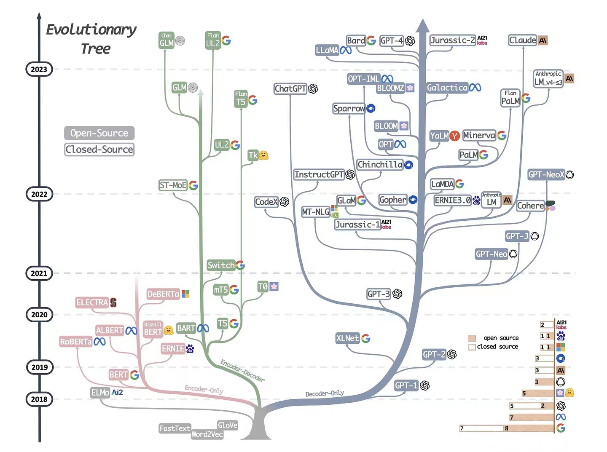
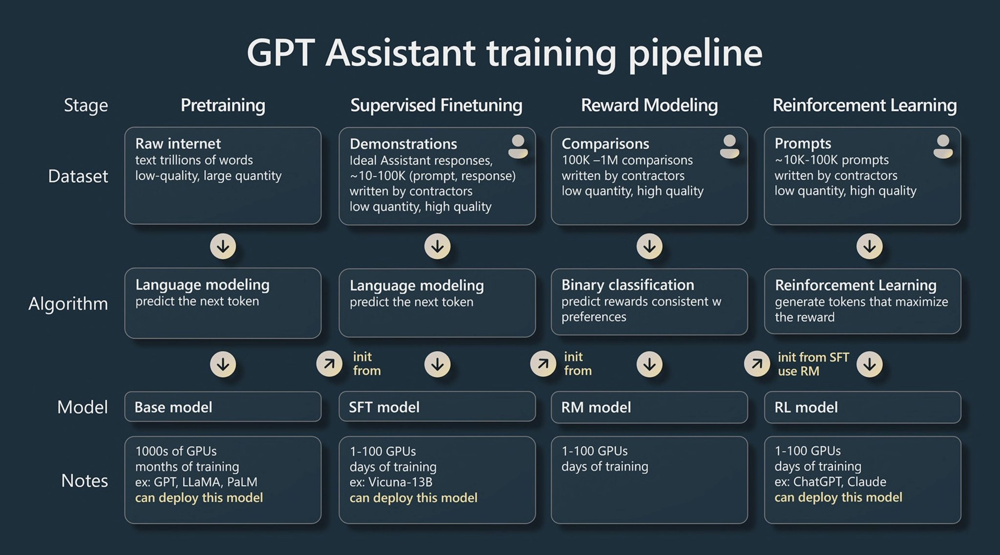
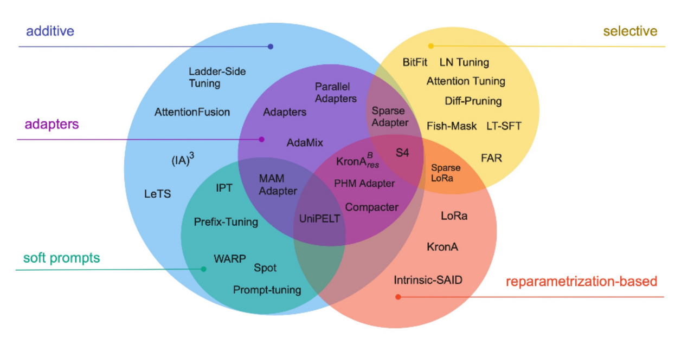
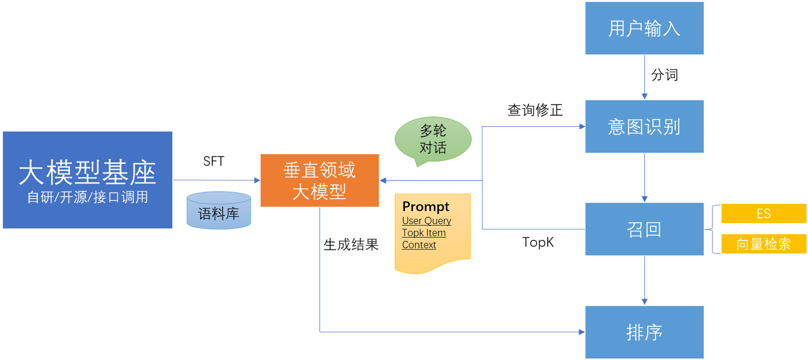

# 背景知识

1. 大模型发展路径

   

   目前基于Transformer架构的模型主要有三大类：编码器架构（Encoder-only）、解码器架构（Decoder-only）、编码器-解码器架构(Encoder-Decoder）[1]；另外基于RMKV架构的模型也值得注意，从其原理来讲，性能优势明显（结合了Linear Transformer和Attention Free Transformer、RNN的原理和结构），但生态还有待完善

   - Encoder-only：自编码模型（破坏一个句子，然后让模型去预测或填补），更擅长理解类的任务，例如：文本分类、实体识别、关键信息抽取等。典型代表有：Bert、RoBERTa等；
   - Decoder-only：自回归模型（将解码器自己当前步的输出加入下一步的输入，解码器融合所有已经输入的向量来输出下一个向量，所以越往后的输出考虑了更多输入），更擅长生成类的任务，例如：文本生成。典型代表有：GPT系列、LLaMA、OPT、Bloom等；
   - Encoder-Decoder：序列到序列模型（编码器的输出作为解码器的输入），主要用于基于条件的生成任务，例如：翻译，概要等。典型代表有：T5、BART、GLM等。

2. 大模型训练步骤

   以ChatGPT为例，大模型通常的训练步骤包含预训练（Pretraining）、有监督的微调(Supervised Fine-Tuning，SFT)、奖励模型(Reward Modeling)以及强化学习(Reinforcement Learing)四个步骤：

   

3. 大模型微调技术

   有监督微调（**SFT**）是大模型训练的重要步骤，也是基于现有大模型训练垂直领域大模型的关键技术手段。

   其中，参数高效微调（**PEFT**）是指微调少量或额外的模型参数，固定大部分预训练模型（LLM）参数，从而大大降低了计算和存储成本，同时，也能实现与全量参数微调相当的性能。参数高效微调方法甚至在某些情况下比全量微调效果更好，可以更好地泛化到域外场景。

   高效微调技术可以粗略分为以下三大类[2]：增加额外参数（additive）、选取一部分参数更新（selective）、引入重参数化（reparametrization-based）。而在增加额外参数这类方法中，又主要分为类适配器（Adapter-like）方法和软提示（Soft prompts）两个小类。

   

   常见的参数高效微调技术有BitFit、Prefix Tuning、Prompt Tuning、P-Tuning、Adapter Tuning、LoRA等

4. 垂直领域大模型

   目前业界也出现了很多针对垂直领域的大模型，例如：

   - 金融领域：如BloombergGPT，FinBERT，[轩辕](https://github.com/Duxiaoman-DI/XuanYuan)（基于LLama2-70B进行中文增强的一系列金融大模型），[Cornucopia](https://github.com/jerry1993-tech/Cornucopia-LLaMA-Fin-Chinese/tree/main)（基于LLama进行微调）等
   - 法律领域：[ChatLaw](https://github.com/PKU-YuanGroup/ChatLaw)（由北京大学开源的大模型，主要有13B、33B），[LexiLaw](https://github.com/CSHaitao/LexiLaw)（基于ChatGLM-6B架构在法律领域的数据集上微调的中文法律大模型）等
   - 医学领域：[BenTsao](https://github.com/SCIR-HI/Huatuo-Llama-Med-Chinese)(基于LLaMA、Bloom等大模型进行微调)、[ChatGLM-6B-Med](https://github.com/SCIR-HI/Med-ChatGLM)、DoctorGLM、ChatMed等

   可以看出，很多垂直领域的大模型都是基于开源大模型（如**ChatGLM、LLama、Bloom**等）通过相关领域的数据进行微调产生。

5. 多模态大模型

   目前业界比较前沿的开源多模态大模型[3]举例如下：

   - [BLip-2](https://github.com/salesforce/LAVIS/tree/main/projects/blip2)：通过利用预训练的视觉模型和语言模型来提升多模态效果和降低训练成本
   - [InstructBLIP](https://github.com/salesforce/LAVIS/tree/main/projects/instructblip)：基于预训练的BLip-2模型通过指令微调得到
   - [MiniGPT-4](https://github.com/Vision-CAIR/MiniGPT-4)，沙特阿拉伯阿卜杜拉国王科技大学的研究团队开源的GPT-4的平民版MiniGPT-4
   - [VisualGLM-6B](https://github.com/THUDM/VisualGLM-6B/)：支持图像、中文和英文的多模态对话语言模型，语言模型基于ChatGLM-6B，具有 62 亿参数；图像部分通过训练[BLIP2-Qformer](https://arxiv.org/abs/2301.12597)构建起视觉模型与语言模型的桥梁，整体模型共78亿参数。

6. 生成式搜索

   目前基于大模型开发出的生成式搜索应用很多，应用形式大致分为两类：

   - 多轮对话机器人：比如chatgpt，文心一言等
   - 搜索结果页结合大模型进行优化：如百度搜索、bing、B站（内侧中）等，通过异步的方式在结果页提供大模型的推荐结果

   两种形式也可以互为补充。目前来看，由于大模型的**性能瓶颈**问题（无法完成毫秒级推断），在传统搜索频道无法用大模型的技术进行替换，只能利用大模型辅助完善搜索功能或者以一种新的产品形态出现。

# 技术选型

利用大模型开发应用可以分为如下三种路径：

- 自研

  自研大模型难度较高，需要相关专业领域的模型算法团队和工程开发团队，并且模型的训练、部署对机器资源、工程基建要求较高，另外，语料的采集、数据的规整也是一项较为繁重的工作，对于大部分垂直领域的公司来讲，利用现有大模型进行应用开发相对较为合适

- 开源

  以开源大模型作为基座利用行业领域内部数据进行微调是大部分垂直领域公司的首选方案，对中文支持较好的开源大模型有[ChatGLM2-6B](https://github.com/THUDM/ChatGLM2-6B)、[baichuan-7B](https:github.com/baichuan-inc/baichuan-7B)等

- 接口：如chatgpt、文心一言等大模型都开放了商用接口（如对话补全、获取embedding、文生图等），需要一定的使用成本，toC的应用尤其需要注意成本的控制和性能的考量

# 技术方案

# 参考文献

[1]Yang J, ** H, Tang R, et al. Harnessing the power of llms in practice: A survey on chatgpt and beyond[J]. arxiv preprint arxiv:2304.13712, 2023.

[2]Lialin V, Deshpande V, Rumshisky A. Scaling down to scale up: A guide to parameter-efficient fine-tuning[J]. arxiv preprint arxiv:2303.15647, 2023.

[3]Yin S, Fu C, Zhao S, et al. A Survey on Multimodal Large Language Models[J]. arxiv preprint arxiv:2306.13549, 2023.

[4]https://www.zhihu.com/question/601594836/answer/3032763174

