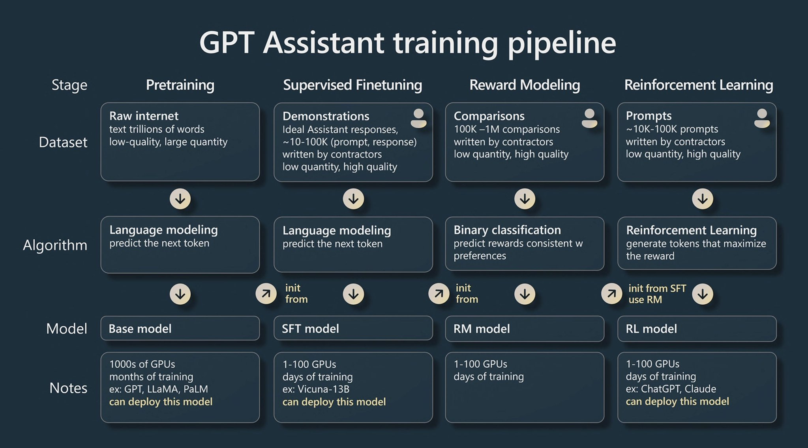

# 背景知识

1. 大模型发展路径

   

   目前基于Transformer架构的模型主要有三大类：仅编码器架构（Encoder-only）、仅解码器架构（Decoder-only）、编码器-解码器架构(Encoder-Decoder）；另外基于RMKV架构的模型也值得注意，从其原理来讲，性能优势明显（结合了Linear Transformer和Attention Free Transformer、RNN的原理和结构），但生态还有待完善

2. 大模型训练步骤

   以ChatGPT为例，大模型通常的训练步骤包含预训练（Pretraining）、有监督的微调(Supervised Fine-Tuning)、奖励模型(Reward Modeling)以及强化学习(Reinforcement Learing)四个步骤：

   

3. 大模型微调技术

   - 

4. 大模型选型

   - 

5. 生成式搜索

   1. 

# 技术方案

# 技术选型

# 参考文献

[1]Yang J, ** H, Tang R, et al. Harnessing the power of llms in practice: A survey on chatgpt and beyond[J]. ar**v preprint ar**v:2304.13712, 2023.

[2]https://www.zhihu.com/question/601594836/answer/3032763174

