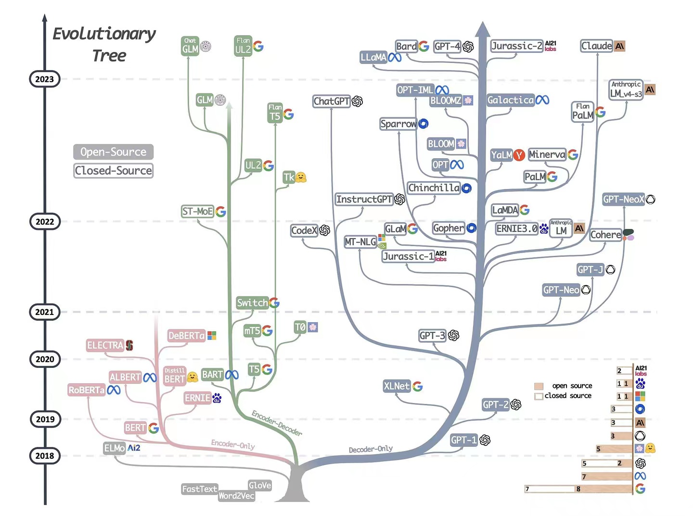
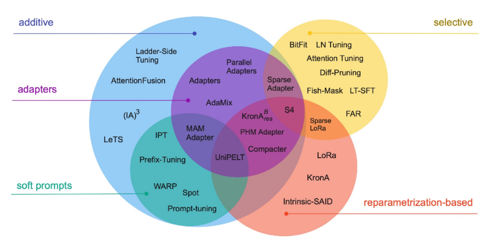

# 背景知识

1. 大模型发展路径

   

   目前基于Transformer架构的模型主要有三大类：编码器架构（Encoder-only）、解码器架构（Decoder-only）、编码器-解码器架构(Encoder-Decoder）[1]；另外基于RMKV架构的模型也值得注意，从其原理来讲，性能优势明显（结合了Linear Transformer和Attention Free Transformer、RNN的原理和结构），但生态还有待完善

   - Encoder-only：自编码模型（破坏一个句子，然后让模型去预测或填补），更擅长理解类的任务，例如：文本分类、实体识别、关键信息抽取等。典型代表有：Bert、RoBERTa等；
   - Decoder-only：自回归模型（将解码器自己当前步的输出加入下一步的输入，解码器融合所有已经输入的向量来输出下一个向量，所以越往后的输出考虑了更多输入），更擅长生成类的任务，例如：文本生成。典型代表有：GPT系列、LLaMA、OPT、Bloom等；
   - Encoder-Decoder：序列到序列模型（编码器的输出作为解码器的输入），主要用于基于条件的生成任务，例如：翻译，概要等。典型代表有：T5、BART、GLM等。

   

2. 大模型训练步骤

   以ChatGPT为例，大模型通常的训练步骤包含预训练（Pretraining）、有监督的微调(Supervised Fine-Tuning)、奖励模型(Reward Modeling)以及强化学习(Reinforcement Learing)四个步骤：

   

3. 大模型微调技术

   参数高效微调是指微调少量或额外的模型参数，固定大部分预训练模型（LLM）参数，从而大大降低了计算和存储成本，同时，也能实现与全量参数微调相当的性能。参数高效微调方法甚至在某些情况下比全量微调效果更好，可以更好地泛化到域外场景。

   高效微调技术可以粗略分为以下三大类：增加额外参数（additive）、选取一部分参数更新（selective）、引入重参数化（reparametrization-based）。而在增加额外参数这类方法中，又主要分为类适配器（Adapter-like）方法和软提示（Soft prompts）两个小类。

   

   常见的参数高效微调技术有BitFit、Prefix Tuning、Prompt Tuning、P-Tuning、Adapter Tuning、LoRA等

4. 生成式搜索

   - 

5. 垂直领域大模型

   - 

# 技术选型

# 技术方案

# 参考文献

[1]Yang J, ** H, Tang R, et al. Harnessing the power of llms in practice: A survey on chatgpt and beyond[J]. arxiv preprint arxiv:2304.13712, 2023.

[2]Lialin V, Deshpande V, Rumshisky A. Scaling down to scale up: A guide to parameter-efficient fine-tuning[J]. arxiv preprint arxiv:2303.15647, 2023.

[2]https://www.zhihu.com/question/601594836/answer/3032763174

